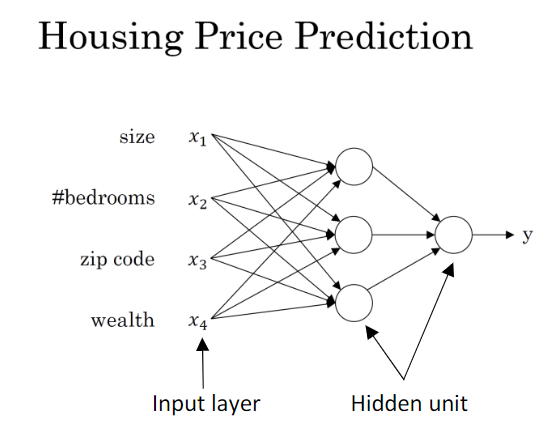
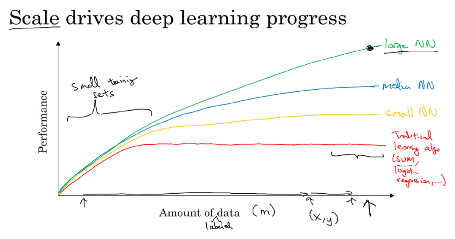
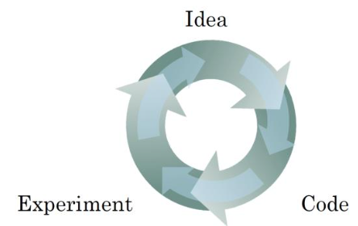

# L1-Week1 深度学习概论

## 一、深度学习和神经网络的概念

1、**深度学习**：训练神经网络的过程

2、**神经网络**：定义了一个映射 $y=f(x;\theta)$，并不断学习参数 $\theta$ 的值，使函数与训练集在最大程度上近似。

## 二、监督学习 Supervised Learning

1、**监督学习**：在训练集中给出每个样本对应的正确结果，从而对nn的学习过程进行监督和优化。

> 现今nn的神奇之处，主要归功于监督学习
> 

2、**监督学习大放异彩的领域**

| 标准nn | 房价预测、个性化广告推送 |
| --- | --- |
| cnn | 图像处理 |
| rnn | 音频识别 |
| hybrid nn | 复杂的无人驾驶系统 |

### 三、结构化数据与非结构化数据

1、结构化数据：格式化、表格化的数据

2、非结构化数据：e.g. 图像、音频、文本

通常，计算机更善于处理结构化数据，而人类更善于处理非结构化数据。DeepLearning诞生后，计算机对非结构化数据的处理能力也得到了显著提升。

### 四、深度学习算法的优越性

通常令m为训练集的规模：

- **m较小**时：性能取决于算法的设计，此时DL算法的性能可能比不上普通的ML算法（SVM等）
- **m很大**时：DL算法的性能稳定优于普通的ML算法

**结论**： **规模** 推动了深度学习的进步（Scale drives deep learning progress）

> 规模主要包括网络规模和数据规模
> 

### 五、深度学习的发展历程

**前期**：侧重于数据量data和算力computation的堆砌

**后期**：侧重于算法algorithm的优化。优化后的算法反过来提高了运算速度。

### 六、深度学习的理论创新之路

可以抽象描述为：以idea为起点形成的理论迭代闭环

