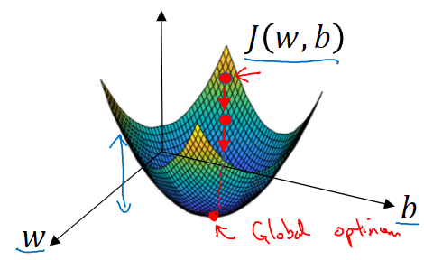
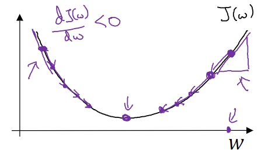

# L1-Week2 神经网络基础

**学习内容**：1、一些DeepLearning的常用技巧；2、为何DeepLearning有正向传播和反向传播？

以Logistic Regression为例进行阐述，该回归算法常用于解决二分分类（Binary Classification）问题

## 一、二分分类问题引入：判断“猫图”

1、机内图片如何表示：**RGB像素矩阵**

<div align="center"></div>

2、将RGB矩阵转为用于输入的**特征向量x**：逐个矩阵、逐行地将元素值抄入一个**列向量**中

<div align="center"></div>


## 二、一些常用术语及缩写

1、$n_x$：特征向量x的维度

2、$(x,y)$：表示一个样本，其中x为输入向量，y为输出向量

3、$\{(x^{(1)},y^{(1)}),(x^{(2)},y^{(2)}),...,(x^{(m)},y^{(m)})\}$：表示一个有m个样本的数据集

4、 $m_{train}$：训练集的样本数量。 $m_{test}$：测试集的样本数量

5、样本矩阵：一般使用列向量来存储样本会比较方便。此时，样本集矩阵X的行数为样本向量的维度 $n_x$，列数为样本集中的样本数量 m。若想通过python得知样本矩阵X的规模，则可调用命令：`X.shape`，其返回结果为$(n_x,m)$

<div align="center"></div>

## 三、逻辑回归 （Logistic Regression）

### 1、Logistic Regression概述

Logistic Regression被用于解决“二分类问题”。以*猫图问题*为例：给定一个$n$维向量 $x\in R^{n_x}$（它代表一张图片），我们希望得知这张图片是一张“猫图”的概率，即求 $\hat{y}=P(y=1|x)\in [0,1]$ 。这就是Logistic Regression的任务。

### 2、逻辑回归的假设函数 $\hat{y}$

逻辑回归的假设函数（Hypothesis Function）一般由线性函数与Sigmoid函数复合而成：

- **线性函数：$z=\omega^Tx+b$**

> $\omega\in R^{n_x}$是特征权重（weights），$b\in R$是偏差值
> 
- **Sigmoid函数**：$\sigma(z)=\frac{1}{1+e^{-z}}$，其图像如下所示

> Sigmoid函数可以修正线性函数，将其改为非线性函数，并使输出的预测值在[0,1]的范围内（表示一个概率）
> 

<div align="center"></div>

**综上所述**：$\hat{y}=\sigma(\omega^T x+b)$，而Logistic Regression的任务就是不断地学习参数 $\omega$ 和 $b$ ，以提高 $\hat{y}$ 的准确率。

### 3、逻辑回归的损失函数 $L(\hat{y},y)$

**定义**：损失函数（Loss Function）用于衡量算法在<font color="red">单个</font>训练样本中的表现，是在<font color="red">单个</font>训练样本中定义的。

#### （1）损失函数的选取 & 常用的损失函数 

==**选取原则**==：无论如何选取损失函数，都一定要保证其是一个<font color="red">凸函数</font>（即：可以被“凸优化”），一旦损失函数是一个非凸函数，则该损失函数只能找到多个局部最优值，从而使得梯度下降算法很可能找不到全局最优值。

> 如下图：左上的损失函数为非凸函数，它不可被凸优化；右下为凸函数，它可被凸优化。可明显看出其区别。
>
> <div align="center"></div>

**常用的一种损失函数**：通常使用预测值$\hat{y}$与实际值y的【差的平方】，或者【差的平方的一半】，作为Loss，即：
$$
L(\hat{y},y)=(\hat{y}-y)^2 或 L(\hat{y},y)=\frac{1}{2}(\hat{y}-y)^2
$$

#### （2）逻辑回归的损失函数

为了保证损失函数的可凸优化性，使用上述的差平方损失函数显然不合适，因此，我们选取下列函数作为逻辑回归的损失函数：
$$
L(\hat{y},y)=-y\log(\hat{y})-(1-y)\log(1-\hat{y})
$$
显然，y=1时，$\hat{y}$ 就要尽可能大；y=0时，$\hat{y}$ 就要尽可能小。该函数呈现出良好的可凸优化性，通过使用梯度下降算法不断地训练w和b，就可以使 $\hat{y}$ 与 y 不断逼近。

### 4、逻辑回归的代价函数 $J(w,b)$

**定义**：代价函数（Cost Function）用于衡量算法在<font color="red">全部</font>训练样本上的表现。

#### （1）代价函数的计算

计算方式：对m个样本的损失函数求和，再除以m。即：
$$
J(w,b)=\frac{1}{m}\sum^{m}_{i=1}L(\hat{y}^{(i)},y^{(i)})，其中 \hat{y}^{(i)},y^{(i)}分别表示第i个样本的预测值和真实值
$$

#### （2）逻辑回归的代价函数

$$
J(w,b)=\frac{1}{m}\sum^{m}_{i=1}[-y\log(\hat{y})-(1-y)\log(1-\hat{y})]
$$

训练逻辑回归模型时，需要找到合适的w和b，以使代价函数的总代价降到最低。逻辑回归可以被视为一个很小的神经网络。


## 四、梯度下降

⚠：梯度下降仅对凸函数优化效果明显，故设置损失函数、代价函数的时候，一定要保证它们是凸函数，否则很难得到全局最优解。

### 1、梯度下降的作用

梯度下降指通过求导迭代的方式，找到损失函数（为一个凸函数）的**最小值点**，从而达到优化参数的作用。由于寻找路径总是沿着该函数的梯度方向，因此被称为“梯度下降”。

> 梯度grad：设$u(x,y,z)$具有一阶连续偏导数，则$grad (u)=\frac{\partial u}{\partial x}i+\frac{\partial u}{\partial y}j+\frac{\partial u}{\partial z}k$

### 2、梯度下降的几何意义

如下图，为一个模型的代价函数（此处为方便几何描述，将w假设为一个实数而非向量），梯度下降就是要从一个起始点开始，一步一步地寻找到该代价函数的最低点，并将该模型的参数w和b调整为它们在该点处的值。

<div align="center"></div>

### 3、梯度下降过程

设代价函数为 $J$ ，则对于其参数 $w$ 而言（这里仍假设 $w$ 为一个实数而非向量），梯度下降的迭代公式为：
$$
w := w- \alpha\frac{\partial J}{\partial w}
$$

> 【:=】 表示更新参数；【$\alpha$ 】表示学习率（learning rate），用于控制梯度下降的步长；【$\frac{\partial J}{\partial w}$】表示代价函数 $J$ 对参数 $w$ 求导。 

下图描述了参数 $w$ 的梯度下降过程，可以看出：当**导数>0**时，下一次更新参数会向**左**移动；当**导数<0**时，下一次更新参数会向**右**移动。直到将参数值优化到能使代价函数 $J$ 的值最小为止。

<div align="center"></div>

此外，在**代码实现**中，我们将使用 `dw` 来表示$\frac{\partial J}{\partial w}$的结果。

这里只是以参数 $w$ 为例，对于代价函数 $J$ 的其他参数，梯度下降的过程与上述过程类似。


##  五、向量化

向量化是一种非常常用的**去除代码中for循环**的艺术。

### 1、向量化的基本原理

简而言之，向量化就是将成批的待运算数据放入一个矩阵中，通过矩阵运算来代替for循环，以达到提高运行效率、节约运行时间的效果。如逻辑回归问题中对 $z = w^Tx + b$ 的计算（$w$与$x$都是$n_x$维的列向量），如果我们采用**非向量化方法**，则Python实现如下：

```python
z = 0
for i in range(n_x)
	z += w[i] * x[i]	# 用循环方式，逐个元素相乘，实现w和x两个列向量的乘法运算
z += b
```

若采用**向量化方法**计算$z=w^Tx+b$，则Python实现只需一行代码：

~~~python
z = np.dot(w,x) + b	 # 调用numpy中的矩阵乘法函数：dot
~~~

二者的差距显而易见。


