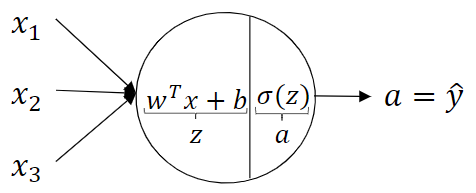
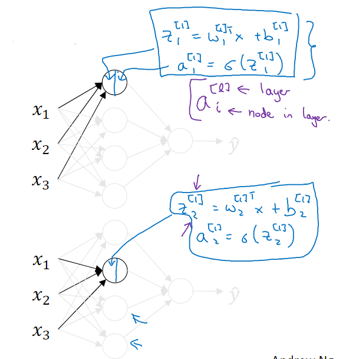
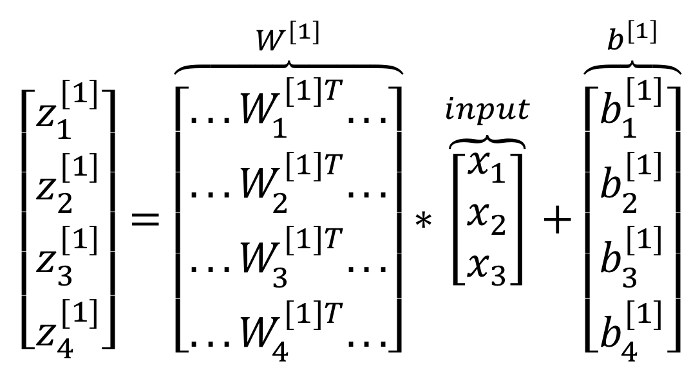
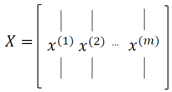
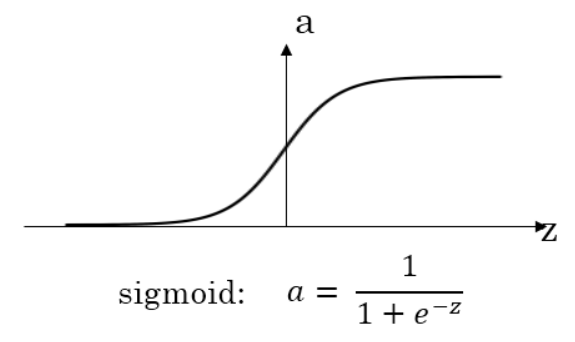
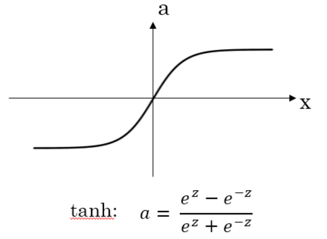
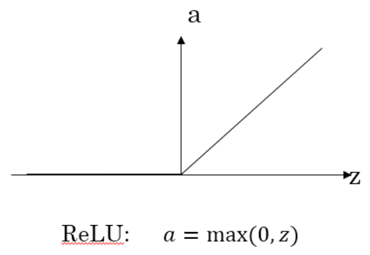
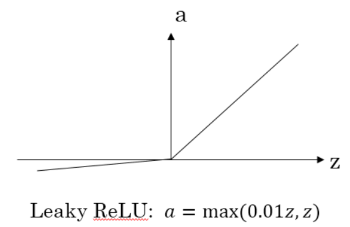

# L1-Week3 浅层神经网络

## 一、神经网络概述

**神经网络的实现方式**——逐层堆叠神经元（如Sigmoid单元）：通过**正向传播**的方式，从左至右逐层地计算输出（后一层使用前一层的output作为input），并最终计算出整个网络的Loss。通过**反向传播**的方式，从右至左逐层地计算每个参数的导数。

**符号约定——上标“[i]”**：表示神经网络第 i 层单元的值

## 二、神经网络的表示

### 1、神经网络的基本结构

如图所示为一个简单的神经网络，神经网络一般由输入层、隐藏层、输出层三部分组成。

- **输入层**：即该神经网络的输入（如上图中的输入特征$x_1,x_2,x_3$）

  > 神经网络**层数计算**：计算网络层数时，输入层通常被称为“第0层”，且不计入总层数内（如上图是一个2层的神经网络）。

- **输出层**：负责产生预测值（如上图中最右侧仅有一个结点、且与 $\hat{y}$ 直接相连的那层）

- **隐藏层**：即除了输入/输出层外的中间层。

  > **“隐藏”的含义**：在监督学习的训练集中，我们只能观察到输入值（输入层各结点的值）和输出标签（预测值），而无法看见中间结点的准确值（被隐藏了）。故称这些结点所在的Layer为隐藏层。

### 2、常用符号惯例

#### （1）激活值$a$

**激活值$a$**：即每个神经元的输出。

网络中的神经元经过运算后，都会产生一些激活值，并传递到它们后面的层中。

#### （2）上标/下标：

- $a^{[i]}$ : 即为第 $i$ 层产生的、传递到第 $i+1$ 层的激活值，它是一个向量。

   > 用于表示输入特征 $x$：输入层的激活值$a^{[0]}$，也就是输入特征。即：$a^{[0]}=x$
   >
   > 用于表示预测值 $\hat{y}$：最后一层的激活值，如上图中的 $a^{[2]}=\hat{y}$，是一个实数。

- $a^{[i]}_j$ : 指第 $i$ 层中第 $j$ 个神经元所生成的激活值。如上图的隐藏层激活值 $a^{[1]}=(a^{[1]}_1,a^{[1]}_2,a^{[1]}_3,a^{[1]}_4)^T$

#### （3）各层参数 $w^{[i]},b^{[i]}$

**隐藏层/输出层**都带有参数。

参数 $w^{[i]},b^{[i]}$ 指与第 $i$ 层相关的参数，它们是一些向量，向量的维度与各层所含神经元数量相关，后续会讲到。

## 三、计算神经网络的输出——向量化方法

这里假设每个神经元均采用逻辑回归的方式进行计算，即 $\hat{y}=\sigma(w^Tx+b)$

### 1、计算单神经元的输出

每个神经元的计算，可以分为2步进行：

1. 计算  $z = w^Tx+b$
2. 计算  $a=\hat{y}=\sigma(z)$

### 2、计算神经网络的输出

对于两层神经网络而言，隐藏层的每个神经元的计算方式都同上，即 $a_i^{[1]}=\sigma(w_i^{[1]}x+b_i^{[1]}), i=1,2,3,4$。

因此，对于神经网络的每层而言，可以采用向量化的方式进行计算：

### 3、m个训练样本下，计算神经网络的输出

对于一个含有m个样本的训练集而言，通常也采用**向量化**的方式进行计算，具体方法为：将各样本的 $x,z,a$ 作为列向量，合成训练集矩阵，进行整体的矩阵运算。下图以 $x$ 为例合成 $X$ 矩阵（==$x^{(i)}$==表示第 $i$ 号样本）：

当各样本矩阵化之后，从**水平**上看，每一列代表了一个训练样本；从**垂直**上看，每一行对应着不同的神经元。计算公式可表示为：
$$
Z^{[1]}=W^{[1]}X+b^{[1]}\\
A^{[1]}=\sigma(Z^{[1]})\\
Z^{[2]}=W^{[2]}A^{[1]}+b^{[2]}\\
A^{[2]}=\sigma(Z^{[2]})
$$

## 四、激活函数

### 1、sigmoid函数

### 2、tanh函数

### 3、ReLU函数

### 4、Leaky ReLU函数

