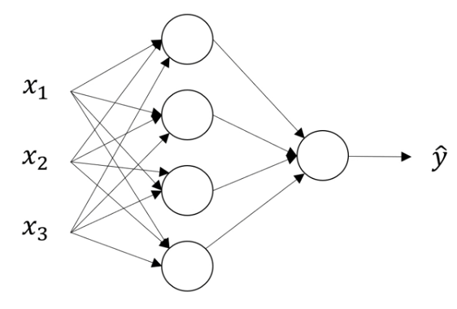

# L1-Week3 浅层神经网络

## 一、神经网络概述

**神经网络的实现方式**——逐层堆叠神经元（如Sigmoid单元）：通过**正向传播**的方式，从左至右逐层地计算输出（后一层使用前一层的output作为input），并最终计算出整个网络的Loss。通过**反向传播**的方式，从右至左逐层地计算每个参数的导数。

**符号约定——上标“[i]”**：表示神经网络第 i 层单元的值

## 二、神经网络的表示

### 1、神经网络的基本结构

如图所示为一个简单的神经网络，神经网络一般由输入层、隐藏层、输出层三部分组成。

- **输入层**：即该神经网络的输入（如上图中的输入特征$x_1,x_2,x_3$）

  > 神经网络**层数计算**：计算网络层数时，输入层通常被称为“第0层”，且不计入总层数内（如上图是一个2层的神经网络）。

- **输出层**：负责产生预测值（如上图中最右侧仅有一个结点、且与 $\hat{y}$ 直接相连的那层）

- **隐藏层**：即除了输入/输出层外的中间层。

  > **“隐藏”的含义**：在监督学习的训练集中，我们只能观察到输入值（输入层各结点的值）和输出标签（预测值），而无法看见中间结点的准确值（被隐藏了）。故称这些结点所在的Layer为隐藏层。

### 2、常用符号——激活值 $a$

- **激活值$a$**：网络中的不同层经过运算后，都会产生一些激活值，并传递到它们后面的层中。

- **上标/下标**：

  1. $a^{[i]}$ : 即为第 $i$ 层产生的、传递到第 $i+1$ 层的激活值，它是一个向量。

     > 用于表示输入特征 $x$：输入层的激活值$a^{[0]}$，也就是输入特征。即：$a^{[0]}=x$
     >
     > 用于表示预测值 $\hat{y}$：最后一层的激活值，如上图中的 $a^{[2]}=\hat{y}$，是一个实数。

  2. $a^{[i]}_j$ : 指第 $i$ 层中第 $j$ 个结点所生成的激活值。如上图的隐藏层激活值 $a^{[1]}=(a^{[1]}_1,a^{[1]}_2,a^{[1]}_3,a^{[1]}_4)^T$

### 3、各层参数 $w^{[i]},b^{[i]}$

隐藏层/输出层都带有参数。

参数 $w^{[i]},b^{[i]}$ 指与第 $i$ 层相关的参数，它们是一些向量，向量的维度与各层所含神经元数量相关。

## 三、神经网络输出的计算

