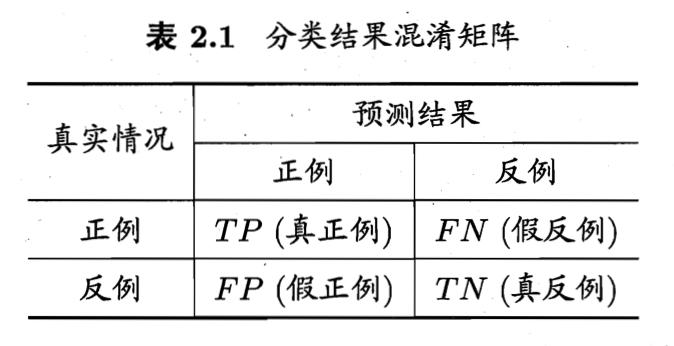
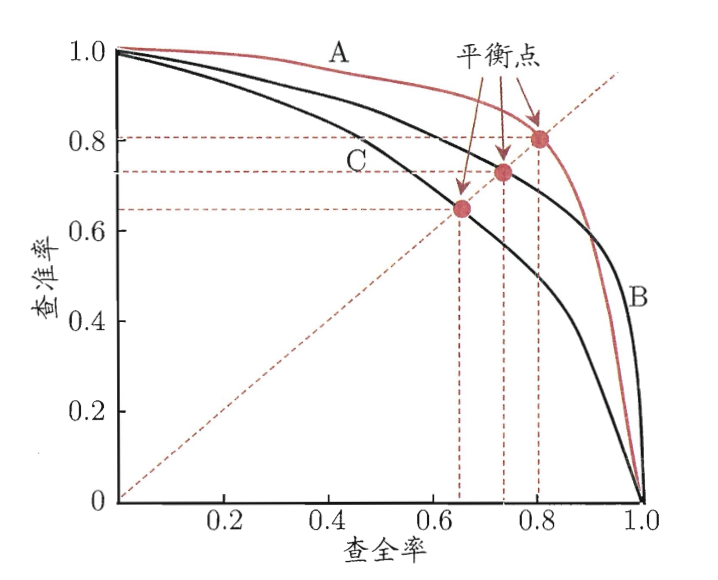

## 2.1 经验误差与过拟合

### 一、错误率与精度

- **错误率：**$错误率=\frac{分类错误的样本数}{总样本数}$
- **精度：**$精度=1-错误率$

### 二、误差

- **误差：**【学习器的预测输出】与【样本的真实输出】之间的差异

- **经验/训练误差：**学习器在训练集上的误差

  **泛化误差：**学习器在新样本上的误差

### 三、过拟合与欠拟合

#### 1、定义

- **过拟合：**学习器把训练样本学得 “太好了”，以至于把训练样本的自身特点误以为是所有潜在样本都会具有的一般性质，从而导致泛化性能下降。
- **欠拟合：**指对训练样本的一般性质尚未学好，与过拟合相对。

#### 2、过拟合的形成原因

1. **根本原因：**我们希望能得到**泛化误差**小的学习器，但实际上我们只能努力降低**经验误差**（因为新样本不可预知），因此很有可能会得到一个在训练集上表现很好（经验误差小），但在新样本上表现一塌糊涂（泛化误差大）的学习器。

2. **影响因素：**常见的情况是——学习能力过于强大; 以至于牵强附会、把训练样本中不那么一般化的特性都学到了。

3. **过拟合的不可避免性：**过拟合是ML面临的关键障碍，它无法被彻底避免，只能尽可能缓解。过拟合的不可避免性大致证明如下：

   > ML面临的问题通常为**NP-hard问题**（即该问题不能在多项式时间内被解决），但有效的学习算法必然能够在多项式时间内运行完成（即只能解决**P问题**），而我们相信 “P$\neq$NP”，因此即使算法在训练集上训练的再好，也无法解决NP问题。故过拟合不可避免。

#### 3、欠拟合的形成原因

1. **形成原因：**通常是由于学习能力低下导致的。
2. **解决办法：**加强学习即可，如：决策树中扩展分支、神经网络学习中增加训练轮数等。

## 2.2 模型评估方法

主要讨论在<u>无法直接获得泛化误差</u>、且<u>不能以经验误差作为标准</u>（可能会过拟合）的情况下，应该如何进行模型的评估与选择。

### 一、模型评估方法

通常，我们使用模型在**测试集**上的**测试误差**，来近似地检验模型的泛化能力。

> 注意：测试集应该尽可能与训练集互斥。

### 二、训练集/测试集的划分方法

当我们只有一个包含m个样例的数据集$D=\{(x_1,y_1),(x_2,y_2),...,(x_m,y_m)\}$时，我们需要对D进行适当的处理，从中产生训练集S和测试集T。

下面是几种常见的划分方法：

#### 1、留出法

##### （1）方法描述

**留出法：**直接将数据集D划分为2个**互斥**的集合，分别作为训练集S和测试集T。在S上训练出模型后，用T来评估其测试误差，作为对模型泛化能力的估计。

##### （2）划分原则：“分层采样”原则

训练/测试集的划分要尽可能保持数据分布的一致性（即各类数据所占比例须一致相同），避免因数据划分不均而引入额外的偏差。

##### （3）多次“留出法”取平均

即使确定了训练/测试集中的样本比例，仍存在多种数据划分方式，且每种划分方式都会产生不同的训练/测试集，也就会得到不同的模型评估结果。

因此，单次“留出法”得到的评估结果是不准确的，一般要采用若干次随机划分、重复进行实验评估后，取平均值，作为留出法的评估结果。

##### （4）“留出法”的窘境

- **训练集S过大：**即S包含绝大多数样本。虽然此时所得模型比较接近于直接用D训练出的模型，但由于T比较小，会导致评估结果不够稳定准确。
- **测试集T过大：**即T包含绝大多数样本。此时被评估的模型与用D训练出的模型相差较大，从而会导致评估结果的保真性降低。

 **常用解决方案：**对于该窘境，目前并无完美的解决方案，常用的做法是将大约2/3～4/5的样本用于训练，其余用于测试。

#### 2、交叉验证法

##### （1）方法描述

**k折交叉验证法：**将数据集D划分为k个大小相似的**互斥**子集，划分时采用**分层采样**的方式进行。然后，每次用k-1个子集作为训练集S，剩下1个子集作为测试集T；轮流k次，使每个子集都担任一次测试集后，取平均值作为最后的结果。

> k最常取10，其次是5、20等

##### （2）多次“k折交叉验证”取平均

将数据集D划分为k个子集同样有多种划分方式，因此与“留出法”一样，“交叉验证法”也需要随机使用不同的划分方式，重复实验后取平均。

##### （3）特例：留一法

**留一法：**若数据集D中包含m个样本，则令$k=m$。即保持D的每个子集中仅含有1个样本。

- **优点：**评估结果被认为比较准确（使用“留一法”训练所得的模型往往与用D直接训练的模型很相近）

  > 但未必一定比其他评估方法准确，“没有免费的午餐”定理对其同样适用

- **缺点：**计算开销大，有时甚至难以负担（需要轮转m次）

#### 3、自助法

##### （1）方法描述

**自助法：**在“自助采样”的基础上实现，**有放回地**在数据集D中进行m次抽样，并将所得到的m个样本作为训练集D‘。同时，用集合D-D'作为测试集。

##### （2）原理剖析

由概率计算知：某个样本在m次采样中始终不被采到的概率是 $(1-\frac{1}{m})^m$，且 $\lim_{m\rightarrow \infty}(1-\frac{1}{m})^m=\frac{1}{e}=0.368$。故在一般情况下，总有一部分样本未被收入训练集D‘，因此可以直接使用这部分样本（即D-D’）作为测试集。

##### （3）优缺点

- **优点：**对数据集较小、难以有效划分训练/测试集时很有用；对集成学习帮助很大（能从原始数据集中产生多个不同的训练集）。
- **缺点：**使用“自助法”产生的数据集会改变初始数据集D的数据分布，从而引入估计偏差。

##### （4）使用场景

- 数据量**大**：留出法、交叉验证法
- 数据量**小**：自助法

#### 4、调参

##### （1）机器学习的2种常用参数

- **算法参数（超参数）**：数目很少（通常10以内），通常由手动设定。
- **模型参数**：数量很多，通过自主学习产生。

##### （2）调参方式

正确的调参方式是：对每个参数选定变化的**范围**和**步长**进行调参，这样可以在一定程度上同时兼顾调参的效率和所得模型的性能。

> 因为许多参数在实数范围内取值，所以调参时无法做到完全遍历；且规定一定的步长进行调参，也有利于提高调参的效率。

#### 5、最终模型

##### （1）最终模型的生成

通常我们将数据集D分离为训练集S和测试集T，是为了选择相对合理的模型（即：确定学习算法和参数）。而一旦模型选定，就需要用完整的数据集D重新训练模型，这样所得到的模型才是最终模型。

##### （2）验证集 vs 测试集

之前所提到的将数据集D一分为二，分别作为训练集S和测试集T。其实这里的测试集T常被称为“验证集”，它被用于模型评估和选择中。故这里我们重新定义一下验证集和测试集。

- **验证集：**属于数据集D的一部分，用于模型评估和选择；一旦选定模型，就要重新放入数据集D，训练最终模型。
- **测试集：**不属于数据集D，是最终模型在实际使用中遇到的数据，仅用于考察模型的泛化能力。

## 2.3 性能度量

**性能度量：**衡量模型泛化能力的评价标准

在预测任务中，给定样例集 $D=\{(x_1,y_1), (x_2,y_2),...,(x_m,y_m)\}$ ，若要评估学习器 $f$ 的性能，就要把学习器预测结果 $f(x)$ 与真实标记 $y$ 做比较。

### 一、回归任务的性能度量

#### 1、均方误差

对于**学习器f：**

- 给定**样例集D**，均方误差： $E(f;D)= \frac{1}{m}\sum^{m}_{i=1}(f(x_i)-y_i)^2$ 

- 给定**数据分布$\mathcal{D}$**和**概率密度函数p**，均方误差：$E(f;\mathcal{D})= \int_{x\sim \mathcal{D}}(f(x)-y)^2p(x)dx$

> **均方误差：**各数据偏离真实值的差值平方和的平均数
>
> **方差：**各数据偏离平均值（期望）的差值平方和的平均数
>
> 均方误差 = 方差 + 偏差

### 二、错误率与精度

对于**学习器f：**

#### 1、错误率 $E$ ：

**错误率：**分类错误的样本占总样本数的比例

- 给定**样例集D**，$E(f;D)=\frac{1}{m}\sum^{m}_{i=1}\mathbb{I}(f(x_i)\neq y_i)$
-  给定**数据分布$\mathcal{D}$**和**概率密度函数p**，$E(f;\mathcal{D})=\int_{x\sim \mathcal{D}}\mathbb{I}(f(x)\neq y)p(x)dx$

#### 2、精度 $acc$：

**精度：**分类正确的样本占总样本数的比例

​			$acc = 1-E$

> **注：** $\mathbb{I}(*)$为**指示函数**，在*为真时取1，为假时取0。

### 三、查准率与查全率

#### 1、二分类问题的混淆矩阵

​	真正例TP、假正例FP、真反例TN、假反例FN

​	**混淆矩阵：**

#### 2、查准率 P (precision)

​	**查准率：**被判断为正例的样例中，真正例TP所占比例

​	$P = \frac{TP}{TP+FP}$

#### 3、查全率 R (recall)

​	**查全率：**所有的正例中，有多少被判断为正例

​	$R=\frac{TP}{TP+FN}$ 

#### 4、P-R曲线（查准率-查全率曲线）

​	查准率和查全率是一对**矛盾**的度量，通常呈现此消彼长的趋势。

P-R曲线的实际含义：

- **包含**：若一个学习器的P-R曲线被另一个学习器的曲线“包含”，则可断言后者性能优于前者（如图中B优于C）。
- **交叉**：难以一般性地断言二者的优劣。若非要比较，则可以通过比较曲线与坐标轴围成面积来计算，**面积大者优**。

### 四、平衡点、$F1-Score$与$F_\beta-Score$

​	这两个性能度量都**综合考虑了查准率、查全率**。

#### 1、平衡点BEP

**平衡点BEP：**“查准率==查全率”时的取值。

在基于BEP的性能比较中，BEP取值大者，其性能较优。（如上图中：A>B>C）

#### 2、$F1-Score$

​	$F1=\frac{2\times P\times R}{P+R}=\frac{2\times TP}{样例总数 + TP - TN}$

> F1是基于查准率和查全率的**调和平均**来定义的：$\frac{1}{F1}=\frac{1}{2} \cdot (\frac{1}{P}+\frac{1}{R})$ 

#### 3、$F_\beta-Score$

​	$F_\beta= \frac{(1+\beta^2)\times P\times R}{(\beta^2 \times P) + R}$

> $F_\beta$ 是F1的一般形式，它基于查准率和查全率的**加权调和平均**来定义：$\frac{1}{F_\beta}=\frac{1}{1+\beta^2}\cdot(\frac{1}{P}+\frac{\beta^2}{R})$

### 五、对n个二分类混淆矩阵的综合考查

很多情况下（e.g 同一训练集多次训练/测试、在多个数据集上训练/测试、执行多分类任务每两两类别的组合）都有多个二分类混淆矩阵。下面讨论在n个二分类混淆矩阵中综合考察查准率和查全率的2种常用方式。

#### 1、宏方式

**方法：**先在各个混淆矩阵上分别算出查准率和查全率$(P_1,R_1),(P_2,R_2),...,(P_n,R_n)$，再计算平均值，就可以得到宏查准率/查全率/F1。

- **宏查准率：**$macroP=\frac{1}{n}\sum^{n}_{i=1}P_i$
- **宏查全率：**$maroR=\frac{1}{n}\sum^{n}_{i=1}R_i$
- **宏F1：**$macroF1=\frac{2\times macroP\times macroR}{macroP+mcroR}$

#### 2、微方式

**方法：**先将各个混淆矩阵的对应元素取平均（$\bar{TP},\bar{FP},\bar{TN},\bar{FN}$），再基于这些平均值计算出微查准率/查全率/F1。

- **微查准率：**$microP=\frac{\bar{TP}}{\bar{TP}+\bar{FP}}$
- **微查全率：**$microR=\frac{\bar{TP}}{\bar{TP}+\bar{FN}}$
- **微F1：**$microF1=\frac{2\times microP\times microR}{microP+microR}$

