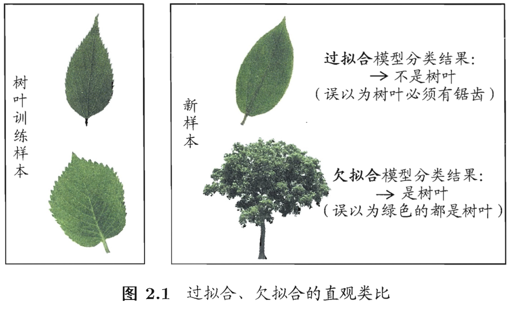

## 2.1 经验误差与过拟合

### 一、错误率与精度

- **错误率：**$错误率=\frac{分类错误的样本数}{总样本数}$
- **精度：**$精度=1-错误率$

### 二、误差

- **误差：**【学习器的预测输出】与【样本的真实输出】之间的差异

- **经验/训练误差：**学习器在训练集上的误差

  **泛化误差：**学习器在新样本上的误差

### 三、过拟合与欠拟合

#### 1、定义

- **过拟合：**学习器把训练样本学得 “太好了”，以至于把训练样本的自身特点误以为是所有潜在样本都会具有的一般性质，从而导致泛化性能下降。
- **欠拟合：**指对训练样本的一般性质尚未学好，与过拟合相对。

#### 2、过拟合的形成原因

1. **根本原因：**我们希望能得到**泛化误差**小的学习器，但实际上我们只能努力降低**经验误差**（因为新样本不可预知），因此很有可能会得到一个在训练集上表现很好（经验误差小），但在新样本上表现一塌糊涂（泛化误差大）的学习器。

2. **影响因素：**常见的情况是——学习能力过于强大; 以至于牵强附会、把训练样本中不那么一般化的特性都学到了。

3. **过拟合的不可避免性：**过拟合是ML面临的关键障碍，它无法被彻底避免，只能尽可能缓解。过拟合的不可避免性大致证明如下：

   > ML面临的问题通常为**NP-hard问题**（即该问题不能在多项式时间内被解决），但有效的学习算法必然能够在多项式时间内运行完成（即只能解决**P问题**），而我们相信 “P$\neq$NP”，因此即使算法在训练集上训练的再好，也无法解决NP问题。故过拟合不可避免。

#### 3、欠拟合的形成原因

1. **形成原因：**通常是由于学习能力低下导致的。
2. **解决办法：**加强学习即可，如：决策树中扩展分支、神经网络学习中增加训练轮数等。

## 2.2 模型评估方法

主要讨论在<u>无法直接获得泛化误差</u>、且<u>不能以经验误差作为标准</u>（可能会过拟合）的情况下，应该如何进行模型的评估与选择。

### 一、模型评估方法

通常，我们使用模型在**测试集**上的**测试误差**，来近似地检验模型的泛化能力。

> 注意：测试集应该尽可能与训练集互斥。

### 二、训练集/测试集的划分方法

当我们只有一个包含m个样例的数据集$D=\{(x_1,y_1),(x_2,y_2),...,(x_m,y_m)\}$时，我们需要对D进行适当的处理，从中产生训练集S和测试集T。

下面是几种常见的划分方法：

#### 1、留出法

#### 2、交叉验证法

#### 3、自助法

#### 4、调参与最终模型

