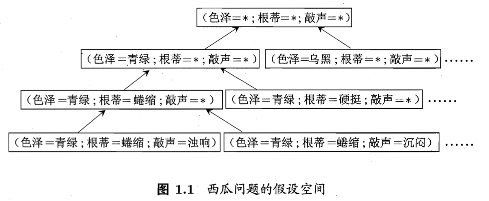

## 1.1 引言

### 什么是机器学习？

**定性**：机器学习是基于经验实现的。

**原理**：通过计算的手段，根据已有的数据不断总结**经验**，从而得到能够做出有效决策的**模型**。

## 1.2 基本术语

### 一、数据相关术语

假定有如下用于描述西瓜特征的数据：

|         |  色泽   |  根蒂   |  敲声   |
| :-----: | :-----: | :-----: | :-----: |
|  西瓜1  |  青绿   |  蜷缩   |  浊响   |
|  西瓜2  |  乌黑   |  稍蜷   |  沉闷   |
| ... ... | ... ... | ... ... | ... ... |
|  西瓜n  |  浅白   |  硬挺   |  清脆   |

现在以上述数据为例，介绍与数据相关的基本术语：

- **属性/特征：**反应对象在某方面的表现、性质的事项（如这里的表头：“色泽”、“根蒂”、“敲声”）。

- **属性值：**属性上的取值（如这里的“青绿”、“蜷缩”、“浊响”）。

- **属性/样本/输入空间：**由属性张成的空间

- **样本/示例/特征向量：**上述表格中的一条记录，由若干个属性组成（如 “西瓜1 : 色泽=青绿，根蒂=蜷缩，敲声=浊响”）。它对应了属性空间中的一个向量。

  > $x_i=(x_{i1};x_{i2};...;x_{id})$：一个由d个属性描述的样本，它对应了$d维样本空间\chi$中的一个向量。

- **数据集：**若干组同类样本的集合（上面的整个表格，就是一个数据集）。

  > $D=\{x_1,x_2,...,x_m\}$：包含m个样本的数据集。 

-  **标记：**样本的结果信息（如“西瓜1 : 色泽=青绿，根蒂=蜷缩，敲声=浊响”是个“好瓜”，这个“好瓜”就是标记）。

- **样例：**拥有了标记的样本被称为样例（如”色泽=青绿，根蒂=蜷缩，敲声=浊响；好瓜“）

  > $(x_i,y_i)$：第 i 个样例

### 二、机器学习过程相关术语

- **学习/训练：**从数据中学得模型的过程。

- **假设：**学得的模型对应了关于数据的某种潜在规律。
  **真相/真实：**指上述的潜在规律本身。
  
  > 假设和真相的关系，有点像大样本情况下，“频率”与“概率”之间的关系。
  
- **分类：**预测值为离散值的学习任务
  **回归：**预测值为连续值的学习任务
  
- **聚类：**经过机器学习，将训练集中具有类似特征的样本，自动划分为若干**簇**。这些簇可能对应了一些潜在的概念划分，有助于我们发现数据的内在规律。

  > 注意：这些潜在概念纯粹是由计算机根据统计学规律发现的，我们事先通常并不知道这些概念。

- **有/无监督学习：**根据训练数据是否有标记信息进行划分。分类/回归问题是有监督学习的典型代表；聚类问题是无监督学习的典型代表。

- **泛化能力：**指模型在对“新样本”的适用能力（而不仅仅是在训练样本上工作得好）。具有强泛化能力的模型能够很好地适用于整个样本空间。

## 1.3 假设空间

### 一、归纳学习

#### 1、归纳与演绎

- **归纳**：从具体的事实，归纳出一般性规律（泛化）
- **演绎**：从基础原理，推演出具体状况（具化）

#### 2、归纳学习

- **广义的归纳学习**：从样例中总结经验
- **狭义的归纳学习（概念学习）**：从训练数据中习得**概念**，故又被称为“概念学习”

### 二、假设空间

#### 1、引入假设空间

可以将归纳学习的过程视为在**由所有假设组成的空间**（所有属性的笛卡尔积，即对所有属性的属性值进行排列组合）中进行搜索的过程。搜索目标：找到与训练集相匹配的假设。

#### 2、假设空间的规模

- **通配符 *** ：当某个属性取任意值时，都能使当前概念成立，则可以用 “属性 = *” 来表示。
- **空集符号 $\varnothing$**：表示不存在属性值，使当前概念成立。

**假设空间规模** = $1+\sum_{i=1}^{n}属性i\cdot(该属性的取值个数+1)$

> 第一个“ 1 ”指的空集，$\sum$内的“ 1 ”指的是通配符。

#### 3、学习过程——搜索剪枝

采用一定的搜索策略，对假设空间进行搜索；同时，在搜索过程中，不断删除<u>与正例不一致/与反例一致</u>的假设。最终，将会得到与训练集一致的假设。

#### 4、版本空间

由上述过程得到的学习结果通常不唯一，即通常会得到多个与训练集一致的假设。这些假设的集合被称之为**版本空间**。

## 1.4 归纳偏好

### 一、归纳偏好

#### 1、定义

**归纳偏好：**机器学习算法在学习过程中，对某种类型假设的偏好。

> 对于版本空间中不同的假设，算法本身会有所“偏好”，并仅选择其中一种来产生模型。

#### 2、归纳偏好的必要性

任何一个有效的机器学习算法，必有其归纳偏好。否则它将被假设空间中，看似在训练集上“等效”的假设所迷惑，从而无法产生确定的学习结果（反复横跳）。

#### 3、与算法性能之间的关系

算法的归纳偏好**是否与问题相匹配**，一般情况下直接决定了算法性能的好坏。

### 二、奥卡姆剃刀法

**奥卡姆剃刀法**：如果有多个假设与观察一致，则选择**最简单**的那个

> 注意：奥卡姆剃刀法中的**简单**究竟应该如何诠释，并不是想当然的，而是一个比较复杂的问题。

### 三、没有免费的午餐（NFL）定理

**NFL定理**：在所有问题出现的机会相同的情况下，无论算法A多聪明，算法B多笨拙，它们的**期望性能都是相同的**。即：任何算法都有其长/短，不存在绝对的优劣，不能脱离具体问题来谈算法的性能。

