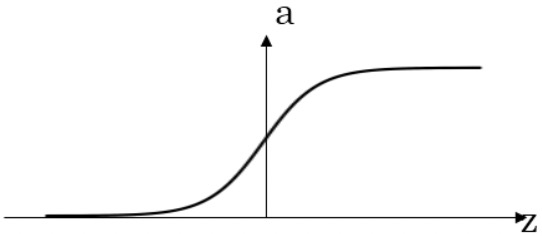
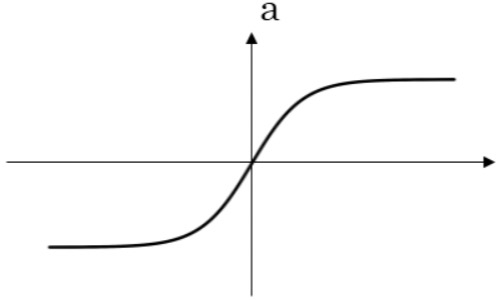
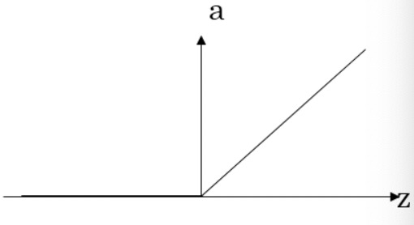
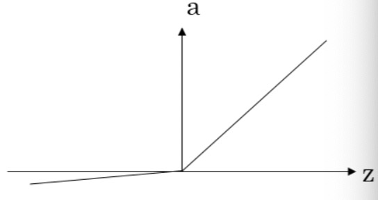

# L1-Week3 浅层神经网络

## 一、神经网络概述

**神经网络的实现方式**——逐层堆叠神经元（如Sigmoid单元）：通过**正向传播**的方式，从左至右逐层地计算输出（后一层使用前一层的output作为input），并最终计算出整个网络的Loss。通过**反向传播**的方式，从右至左逐层地计算每个参数的导数。

**符号约定——上标“[i]”**：表示神经网络第 i 层单元的值

## 二、神经网络的表示

### 1、神经网络的基本结构

如图所示为一个简单的神经网络，神经网络一般由输入层、隐藏层、输出层三部分组成。

- **输入层**：即该神经网络的输入（如上图中的输入特征$x_1,x_2,x_3$）

  > 神经网络**层数计算**：计算网络层数时，输入层通常被称为“第0层”，且不计入总层数内（如上图是一个2层的神经网络）。

- **输出层**：负责产生预测值（如上图中最右侧仅有一个结点、且与 $\hat{y}$ 直接相连的那层）

- **隐藏层**：即除了输入/输出层外的中间层。

  > **“隐藏”的含义**：在监督学习的训练集中，我们只能观察到输入值（输入层各结点的值）和输出标签（预测值），而无法看见中间结点的准确值（被隐藏了）。故称这些结点所在的Layer为隐藏层。

### 2、常用符号惯例

#### （1）激活值$a$

**激活值$a$**：即每个神经元的输出。

网络中的神经元经过运算后，都会产生一些激活值，并传递到它们后面的层中。

#### （2）上标/下标：

- $a^{[i]}$ : 即为第 $i$ 层产生的、传递到第 $i+1$ 层的激活值，它是一个向量。

   > 用于表示输入特征 $x$：输入层的激活值$a^{[0]}$，也就是输入特征。即：$a^{[0]}=x$
   >
   > 用于表示预测值 $\hat{y}$：最后一层的激活值，如上图中的 $a^{[2]}=\hat{y}$，是一个实数。

- $a^{[i]}_j$ : 指第 $i$ 层中第 $j$ 个神经元所生成的激活值。如上图的隐藏层激活值 $a^{[1]}=(a^{[1]}_1,a^{[1]}_2,a^{[1]}_3,a^{[1]}_4)^T$

#### （3）各层参数 $w^{[i]},b^{[i]}$

**隐藏层/输出层**都带有参数。

参数 $w^{[i]},b^{[i]}$ 指与第 $i$ 层相关的参数，它们是一些向量，向量的维度与各层所含神经元数量相关，后续会讲到。

## 三、计算神经网络的输出——向量化方法

这里假设每个神经元均采用逻辑回归的方式进行计算，即 $\hat{y}=\sigma(w^Tx+b)$

### 1、计算单神经元的输出

每个神经元的计算，可以分为2步进行：

1. 计算  $z = w^Tx+b$
2. 计算  $a=\hat{y}=\sigma(z)$

### 2、计算神经网络的输出

对于两层神经网络而言，隐藏层的每个神经元的计算方式都同上，即 $a_i^{[1]}=\sigma(w_i^{[1]}x+b_i^{[1]}), i=1,2,3,4$。

因此，对于神经网络的每层而言，可以采用向量化的方式进行计算：

### 3、m个训练样本下，计算神经网络的输出

对于一个含有m个样本的训练集而言，通常也采用**向量化**的方式进行计算，具体方法为向量**矩阵化**，即：把各样本的 $x(即a^{[0]})、z^{[i]}、a^{[i]}$ 作为列向量，合成完整的训练集矩阵，然后再进行整体的矩阵运算。

>  下图以 $x$ 合成 $X$ 矩阵为例（注：$x^{(i)}$表示第 $i$ 号样本）：

当各样本矩阵化之后，从**水平**上看，每一列代表了一个训练样本；从**垂直**上看，每一行对应着不同的神经元。计算公式可表示为：
$$
Z^{[1]}=W^{[1]}X+b^{[1]}\\
A^{[1]}=\sigma(Z^{[1]})\\
Z^{[2]}=W^{[2]}A^{[1]}+b^{[2]}\\
A^{[2]}=\sigma(Z^{[2]})
$$

## 四、常用的激活函数（Activation Functions）

### 1、sigmoid函数

**函数解析式**：$a=\sigma(z)=\frac{1}{1+e^{-z}}$

**用途**：只有当预测结果$\in [0,1]$时（如二分类问题），才使用sigmoid函数作为输出层的激 活函数，否则绝对不要用。

### 2、tanh函数

tanh是由sigmoid函数**平移**得到的，且往往优于sigmoid函数，故通常用tanh代替sigmoid函数。

**函数解析式**：$a=tanh(z)=\frac{e^z-e^{-z}}{e^z+e^{-z}}$

**优点**：所得函数值$\in [-1,1]$，故均值在0附近，有利于**数据中心化**，便于下一层隐藏层学习

---

sigmoid和tanh函数的**共同缺陷**：当$z=w^Tx+b$的直很大时，$a=g(z)$的斜率就会很小，从而导致梯度下降效率极低。因此，现在比较少使用这两个函数作为激活函数，而是更经常地使用ReLU作为激活函数。

### 3、修正线性单元ReLU（Rectified Linear Unit）——最常用的万金油

**函数解析式**：$a=relu(z)=max\{0,z\}$

**z=0的情况**：此时理论上导数无意义，但实现的时候，可以令该点导数为1或0。这样处理并不会影响最终结果。

**用途**：一般情况下都可以使用ReLU作为激活函数，因为它总保持一定的斜率；因此对大多数z而言，ReLU比sigmoid/tanh的效率高很多很多。

### 4、Leaky ReLU函数（带泄漏的ReLU）

**特点**：当z小于0时，仍保持一定的斜率，而不是令斜率直接为0。

**函数解析式**：$a=leakyRelu(z)=max\{0.01z,z\}$

## 五、为何需要非线性的激活函数

假设在一个2层神经网络中，使用线性函数作为激活函数，即令$g(z)=z$，则此时有：
$$
a^{[1]}=z^{[1]}=w^{[1]}x+b^{[1]}\\
a^{[2]}=z^{[2]}=w^{[2]}a^{[1]}+b^{[2]}=w^{[2]}(w^{[1]}x+b^{[1]})+b^{[2]}=(w^{[2]}w^{[1]})x+(w^{[2]}b^{[1]}+b^{[2]})
$$
可以看出，$a^{[2]}=\hat{y}$ 仍为 $x$ 的线性函数，无论有多少层隐藏层，都跟不加隐藏层没有区别。因此在隐藏层单元使用线性函数是不可取的，必须对其进行**非线性化**处理，即添加激活函数。

> 注：只有**回归问题的输出层**中可能可以直接使用线性函数（如房价预测问题），但仍然非常少见

## 六、激活函数的导数

### 1、sigmoid的导数

$$
a=\sigma(z)=\frac{1}{1+e^{-z}}\\
\sigma'(z)=a(1-a)=\frac{1}{1+e^{-z}}(1-\frac{1}{1+e^{-z}})
$$

### 2、tanh的导数

$$
a=tanh(z)=\frac{e^z-e^{-z}}{e^z+e^{-z}}\\
tanh'(z)=1-a^2=1-(\frac{e^z-e^{-z}}{e^z+e^{-z}})^2
$$

### 3、ReLU的导数

$$
a=relu(z)=max(0,z)\\
relu'(z)=
\begin{cases}
0&z<0\\
1&z>0\\
undefined&z=0
\end{cases}
$$

### 4、Leaky ReLU的导数

$$
a=leakyRelu(z)=max(0.01z,z)\\
leakyRelu'(z)=
\begin{cases}
0&z<0\\
1&z>0\\
undefined&z=0
\end{cases}
$$

