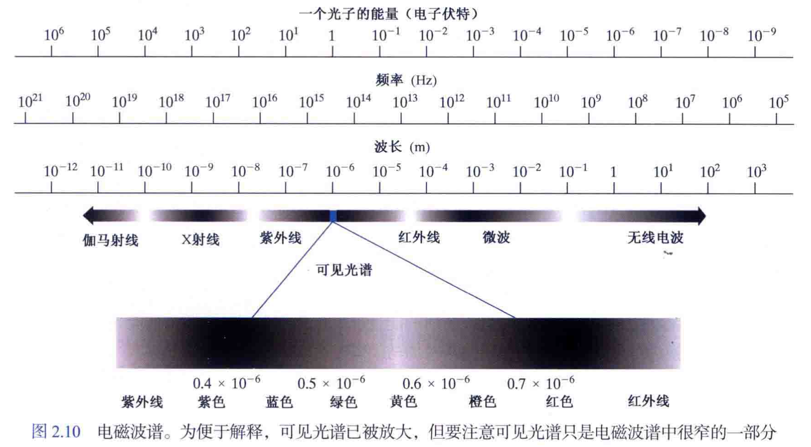
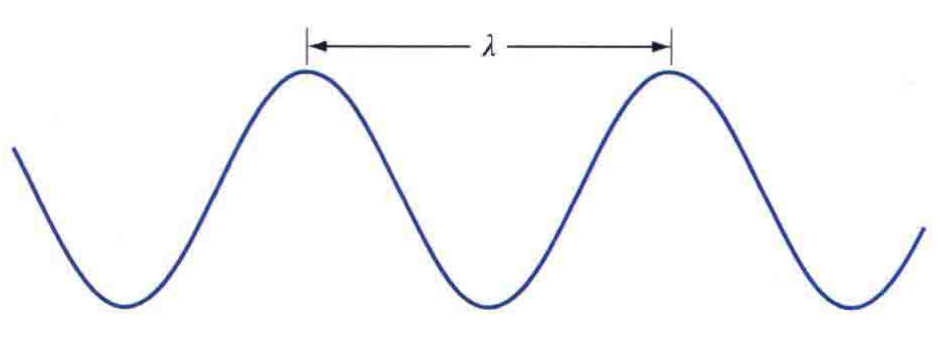

## 2.1 视觉感知要素

简述了人类视觉系统的一些重要方面，包括人眼中图像的形成及人眼适应和辨别灰度的能力。

## 2.2 电磁波谱和光

### 一、电磁波谱

电磁波谱如图所示，我们所感知的可见光在电磁波谱中，只占据很小的一部分。

#### 1、电磁波谱的表示

电磁波谱可以用波长$\lambda$ or 频率$v$ or 能量$E$ 来表示。

- 波长与频率：$\lambda = c/v$

  > $c$ 为光速

- 能量：$E=hv$

  > $h$ 为普朗克常数

### 二、电磁波

#### 1、电磁波的定义

**电磁波**可被视为：

1. 以波长$\lambda$传播的正弦波；
2. 没有质量的粒子流，且每个粒子像波浪一样行进，并以光速运动。

#### 2、光子

**光子：**电磁波中，每个无质量的粒子都具有一定的能量。且由$E=hv$可知：电磁波频率越高，其粒子能量也就越高。

### 三、光

光是一种**电磁辐射**，它可以被人眼感知。我们所感知的**可见光**在电磁波谱中，只占很小的一部分。

#### 1、单色光/无色光

**单色光/无色光：**没有颜色、只有亮度的光（黑白照片）。单色光的唯一属性是其亮度。

**灰度级：**单色光从黑到白的数值范围。

**灰度图像：**即单色图像

#### 2、彩色光

**描述彩色光源的量：**频率、辐射、光通量、亮度。

1. 频率：即电磁波的频率$\lambda$
2. 辐射：从光源流出的总能量（单位：瓦特 W）
3. 光通量：观察者从光源感知的能量（单位：流明 lm）
4. 亮度：人的主观感知，实际上不作为度量标准

## 2.3 图像感知与获取

### 一、图像的产生方式

大多数图像都是由**“照射源“**和形成图像的**”场景“**元素对光能的反射/吸收产生的。

> 这里的照射源、场景并不仅仅指“可见光源照射三维场景”，其含义更加广泛，如照射源可以指超声波照射，场景也可以是分子、沉积岩、人脑等。

### 二、图像的感知获取方式

通常有使用**单个**传感器获取图像、使用**条带**传感器获取图像、使用**阵列**传感器获取图像3种方式。

### 三、简单的成像模型

一般使用二维函数$f(x,y)$来表示图像，$f(x,y)$的值是**与物理源辐射能量成正比**的标量，其计算方式如下：
$$
f(x,y)=i(x,y)r(x,y)
$$
函数$f(x,y)$被表征为两个分量的乘积：

- **入射分量** $i(x,y)$：射入被观察场景的光源照射量，其性质取决于照射源头，且$0<i(x,y)<\infty$
- **反射分量** $r(x,y)$:被场景中物体反射的照射量，其性质取决于被成像物体的特性，且$0<r(x,y)<1$（0代表全吸收，1代表全反射）

## 2.4 图像的取样与量化

